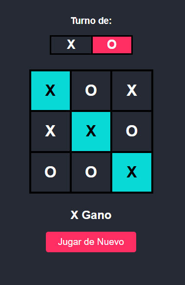

<h1 align="center"> Primer juego </h1>
Un ejemplo basico del conocido juego <b>tic tac toe</b> realizado en las bases de la programacion web con

puedes ensayarlo en el siguiente link
https://xarcraft.github.io/juegos/tic%20tac%20toe/
